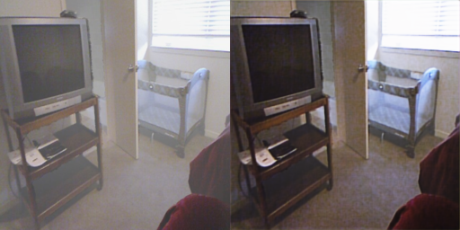
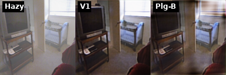

# Restore-RWKV Dehazing

基于 [Restore-RWKV](https://arxiv.org/abs/2407.11087) 的 **Vision-RWKV 图像去雾**实验仓库。

[](https://arxiv.org/abs/2407.11087)
[](LICENSE)
[](https://github.com/FBB123571)

---

## 效果展示

| V1 基线 | 插件消融（A/B/C/D） |
|:---:|:---:|
|  |  |

- V1 对比图：[`outputs/rwkv/compare/`](outputs/rwkv/compare/)
- 插件 A：[`outputs/preview_plugins_best128/`](outputs/preview_plugins_best128/)
- 插件 B/C/D：[`outputs/preview_plugins_v2/`](outputs/preview_plugins_v2/)

**中期实验报告**：[PDF 下载](docs/Restore-RWKV_中期实验报告.pdf)（含对比图、流程图、指标图）· [Markdown](docs/MIDTERM_REPORT.md)

重新生成 PDF：`python scripts/generate_midterm_report_premium.py` · [PDF 下载](docs/Restore-RWKV_中期实验报告.pdf)

---

## 快速开始

```bash
git clone https://github.com/FBB123571/Restore-RWKV.git
cd Restore-RWKV
bash run_demo.sh          # V1 推理
python test_demo_cnn.py   # CNN 基线
```

环境：Python 3.8+，PyTorch + CUDA（已在 `snake1` conda 环境验证）。

---

## 预训练权重

| 文件 | 说明 |
|------|------|
| `checkpoints/rwkv/rwkv_dehaze_epoch_50.pth` | V1 去雾权重（128 训练） |
| `checkpoints/cnn/cnn_baseline_epoch_99.pth` | CNN 消融基线 |

插件权重在本地 `checkpoints/rwkv_plugin_v2/`，需自行训练（见下）。

**已发布权重**（仓库内 + [GitHub Releases](https://github.com/FBB123571/Restore-RWKV/releases)）：

| 文件 | 说明 |
|------|------|
| `checkpoints/rwkv_plugin_release/plugin_A_epoch_0.pth` | A（近 V1） |
| `checkpoints/rwkv_plugin_release/plugin_{A,B,C,D}_epoch_14.pth` | 全量训练最终 epoch |
| `checkpoints/rwkv_plugin_weights.zip` | 以上打包下载 |

---

## V1 冻结 + 插件消融（推荐）

在 **不修改** `model_rwkv.py` 的前提下，仅训练轻量插件：

| 插件 | 方向 | 说明 |
|------|------|------|
| A | Fourier Mix | 频域混合残差 |
| B | Dual-domain | 高频分支精炼 |
| C | Depth gate | 深度门控 |
| D | Spatial refine | 轻量空间残差 |

### 训练流程（先模板，再全量）

```bash
# 1) 模板试训（512 张 × 3 epoch，约 3–5 分钟）
bash scripts/template_B.sh

# 2) 全量（需模板 PASS，约 15–18 分钟）
bash scripts/train_plugin_full.sh B

# 3) 预览与指标
python scripts/preview_plugins.py --plugin_dir checkpoints/rwkv_plugin_v2 --run_name full --only B --epoch 14
python scripts/eval_plugins_metrics.py --plugin_dir checkpoints/rwkv_plugin_v2 --run_name full --epoch 14
```

完整说明：[`docs/PLUGIN_TRAIN_WORKFLOW.md`](docs/PLUGIN_TRAIN_WORKFLOW.md)

### 中期指标（500 张 hold-out，128px）

见 [`data/result/plugin_metrics_full.csv`](data/result/plugin_metrics_full.csv)。V1：**PSNR 20.66 / SSIM 0.827**；插件 A/C 与 V1 接近。

---

## 项目结构

```
Restore-RWKV/
├── model_rwkv.py           # V1 网络
├── model_rwkv_plugin.py    # 冻结 V1 + 插件
├── clean_train.py          # V1 训练
├── clean_train_plugin.py   # 插件训练
├── scripts/                # 模板/全量/预览/评测
├── docs/MIDTERM_REPORT.md  # 中期报告
├── test_images/
└── outputs/
```

---

## 训练 V1

```bash
# 数据: data/dehaze_data/archive(1)/{hazy,clear}
python clean_train.py
```

---

## Citation

```bibtex
@article{yang2026restorerwkv,
  title={Restore-rwkv: Efficient and effective medical image restoration with rwkv},
  author={Yang, Zhiwen and Li, Jiayin and Zhang, Hui and Zhao, Dan and Wei, Bingzheng and Xu, Yan},
  journal={IEEE Journal of Biomedical and Health Informatics},
  year={2026},
  volume={30},
  number={1},
  pages={513-526}
}
```

---

## License

见 [LICENSE](LICENSE)。
