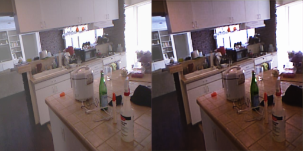

# Restore-RWKV Dehazing

基于 [Restore-RWKV](https://arxiv.org/abs/2407.11087) 思路实现的 **Vision-RWKV 图像去雾**实验仓库，包含：

- **Vision-RWKV 去雾网络**（空间 Token Shift + RWKV 双模块）
- **纯卷积 CNN 基线**（消融对比）
- 预训练权重、测试脚本与可视化结果

[](https://arxiv.org/abs/2407.11087)
[](LICENSE)

---

## 效果展示

左：有雾输入 · 右：Vision-RWKV 去雾（`epoch_50`）

| | |
|:---:|:---:|
|  |  |

更多样例见 [`outputs/rwkv/compare/`](outputs/rwkv/compare/) 与 [`outputs/cnn_ablation/compare/`](outputs/cnn_ablation/compare/)（卷积基线对比）。

---

## 快速开始

### 环境

- Python 3.8+
- PyTorch + torchvision（已在 `snake1` / 自建 `restore` 等 conda 环境中验证）

### 一键推理

```bash
git clone https://github.com/Yaziwel/Restore-RWKV.git
cd Restore-RWKV
bash run_demo.sh
```

脚本会自动选择可用的 Python（优先 `restore`，否则 `~/miniconda3/envs/snake1`）。

### 分别运行

```bash
# Vision-RWKV（推荐）
python test_demo.py

# 纯卷积消融基线
python test_demo_cnn.py
```

### 输出目录

| 模型 | 仅去雾结果 | 原图\|去雾对比 |
|------|-----------|----------------|
| Vision-RWKV | `outputs/rwkv/result/` | `outputs/rwkv/compare/` |
| CNN 基线 | `outputs/cnn_ablation/result/` | `outputs/cnn_ablation/compare/` |

测试图放入 [`test_images/`](test_images/)（支持 `.png` / `.jpg`）。

---

## 预训练权重

| 文件 | 说明 |
|------|------|
| [`checkpoints/rwkv/rwkv_dehaze_epoch_50.pth`](checkpoints/rwkv/rwkv_dehaze_epoch_50.pth) | 当前效果最好的 RWKV 权重 |
| [`checkpoints/cnn/cnn_baseline_epoch_99.pth`](checkpoints/cnn/cnn_baseline_epoch_99.pth) | 纯卷积消融基线 |

---

## 项目结构

```
Restore-RWKV/
├── model_rwkv.py           # Vision-RWKV 去雾网络
├── model_cnn_baseline.py   # 纯卷积基线（消融）
├── clean_train.py          # RWKV 训练
├── test_demo.py            # RWKV 推理
├── test_demo_cnn.py        # CNN 推理
├── run_demo.sh             # 一键推理脚本
├── checkpoints/            # 权重
├── test_images/            # 测试输入
├── outputs/                # 推理结果
└── data/dehaze_data/       # 训练数据（需自行准备，见 .gitignore）
```

### 网络要点（RWKV 版）

- `hidden_dim=32`, `num_blocks=2`（与 `epoch_50` 权重一致）
- 2D 空间 Token Shift + SpatialMix / ChannelMix
- 全局残差：`out = sigmoid(conv(feat)) + x`，只学习去雾残差

详见 [`model_rwkv.py`](model_rwkv.py)。

---

## 训练

1. 将去雾数据集放到 `data/dehaze_data/archive(1)/hazy` 与 `.../clear`
2. 运行：

```bash
python clean_train.py
```

权重默认保存到 `checkpoints/rwkv/rwkv_dehaze_epoch_{N}.pth`（每 5 epoch 存一次）。

---

## 与原版 Restore-RWKV 的关系

本仓库在官方 [Restore-RWKV](https://github.com/Yaziwel/Restore-RWKV) 医学图像复原代码基础上，**改为去雾任务实验分支**，移除了 MRI/CT/PET 相关训练与评测脚本，保留并扩展了 RWKV 风格视觉模块用于去雾。

原版论文与资源：

- 论文：[arXiv:2407.11087](https://arxiv.org/abs/2407.11087)
- 合集：[Awesome-RWKV-in-Vision](https://github.com/Yaziwel/Awesome-RWKV-in-Vision) · [Awesome-Medical-Image-Restoration](https://github.com/Yaziwel/Awesome-Medical-Image-Restoration)

---

## Citation

若使用原版 Restore-RWKV 方法，请引用：

```bibtex
@article{yang2026restorerwkv,
  title={Restore-rwkv: Efficient and effective medical image restoration with rwkv},
  author={Yang, Zhiwen and Li, Jiayin and Zhang, Hui and Zhao, Dan and Wei, Bingzheng and Xu, Yan},
  journal={IEEE Journal of Biomedical and Health Informatics},
  year={2026},
  volume={30},
  number={1},
  pages={513-526},
  publisher={IEEE}
}
```

---

## License

本项目遵循 [LICENSE](LICENSE) 文件中的许可协议。
